# Prospero — Implementation Plan

> **Version:** 0.1.0-draft
> **Last Updated:** 2026-02-27
> **Status:** Planning

---

## Table of Contents

1. [Technology Stack](#1-technology-stack)
2. [Architecture Overview](#2-architecture-overview)
3. [Solution Structure](#3-solution-structure)
4. [Domain Model](#4-domain-model)
5. [Phased Implementation](#5-phased-implementation)
6. [Infrastructure & DevOps](#6-infrastructure--devops)

---

## 1. Technology Stack

### Runtime & Framework

| Component | Technology | Rationale |
|-----------|-----------|-----------|
| **Runtime** | .NET 10 | Latest LTS, top performance, native AOT potential |
| **Orchestration** | .NET Aspire 9.x | Service discovery, health checks, local dev dashboard, OpenTelemetry |
| **API** | ASP.NET Core Minimal APIs | Low ceremony, high performance, good for resource-oriented design |
| **Frontend** | Blazor WebAssembly (PWA) | Offline-first capable, C# full-stack, PWA installable |
| **ORM** | Entity Framework Core 10 | Migrations, LINQ queries, PostgreSQL provider |
| **Database** | PostgreSQL 17 | Robust, financial-grade, excellent .NET Aspire integration |

### Key Libraries

| Library | Purpose |
|---------|---------|
| **MediatR** | CQRS pipeline: command/query dispatching with pipeline behaviors (validation, logging, transactions) |
| **OneOf / FluentResults** | Option/Result discriminated union types for null-avoidance and explicit error handling |
| **Microsoft.RulesEngine** | User-configurable business rules for transaction categorization |
| **FluentValidation** | Input validation across API and domain layers |
| **Serilog + OpenTelemetry** | Structured logging with distributed tracing |
| **OFXSharp / QIF parser** | OFX/QFX and QIF file format parsing |
| **CsvHelper** | CSV parsing with configurable column mapping |
| **Microsoft.AspNetCore.Identity** | Local username/password authentication |
| **Microsoft.AspNetCore.Authentication.OpenIdConnect** | Google/Microsoft SSO |
| **Blazored.LocalStorage** | IndexedDB/localStorage access from Blazor WASM |
| **MudBlazor** or **Fluent UI Blazor** | Component library for the PWA UI |
| **Microsoft.AspNetCore.DataProtection** | Application-level field encryption |
| **Yarp** or Aspire built-in | Reverse proxy if needed |
| **OllamaSharp** | .NET client for local Ollama LLM integration |
| **Bogus** | Realistic test and seed data generation |
| **Asp.Versioning** | API versioning for safe rolling upgrades between PWA and server |

### Infrastructure

| Component | Technology |
|-----------|-----------|
| **Containers** | Docker with multi-stage builds |
| **Orchestration (Dev)** | .NET Aspire AppHost |
| **Orchestration (Prod)** | Docker Compose |
| **CI/CD** | GitHub Actions |
| **Container Registry** | GitHub Container Registry (ghcr.io) |
| **Reverse Proxy / TLS** | Caddy or Traefik (auto-HTTPS in Docker Compose) |

---

## 2. Architecture Overview

### High-Level Architecture


### Backend Layered Architecture


### Offline-First Data Flow


---

## 3. Solution Structure

```
finance/
├── docs/
│   ├── FEATURES.md
│   └── IMPLEMENTATION-PLAN.md
│
├── src/
│   ├── Prospero.AppHost/                    # .NET Aspire orchestrator
│   │   ├── Program.cs
│   │   └── Prospero.AppHost.csproj
│   │
│   ├── Prospero.ServiceDefaults/            # Shared Aspire service defaults
│   │   ├── Extensions.cs
│   │   └── Prospero.ServiceDefaults.csproj
│   │
│   ├── Prospero.Domain/                     # Domain layer (pure C#, no dependencies)
│   │   ├── Entities/
│   │   │   ├── Account.cs                   # Base account entity
│   │   │   ├── Transaction.cs
│   │   │   ├── TransactionSplit.cs           # Logical split line (child of Transaction)
│   │   │   ├── Budget.cs
│   │   │   ├── SinkingFund.cs                # Lump-sum savings target
│   │   │   ├── RecurringTransaction.cs
│   │   │   ├── Holding.cs
│   │   │   ├── Lot.cs
│   │   │   ├── ForecastScenario.cs           # Named growth rate scenario
│   │   │   ├── User.cs
│   │   │   ├── ImportBatch.cs                # Import tracking and rollback
│   │   │   ├── AuditEvent.cs                 # Append-only audit trail
│   │   │   ├── Category.cs                   # Hierarchical transaction category
│   │   │   ├── Tag.cs                        # Managed tag entity
│   │   │   ├── Payee.cs                      # Normalized payee with aliases
│   │   │   ├── ExchangeRate.cs               # Historical FX rates
│   │   │   ├── PriceHistory.cs               # Point-in-time security prices (AsOfDate + RecordedAt)
│   │   │   ├── Valuation.cs                  # Manual asset valuations (EffectiveDate + RecordedAt)
│   │   │   ├── ContributionRoom.cs           # Registered account contribution tracking
│   │   │   ├── ReconciliationPeriod.cs       # Statement reconciliation state
│   │   │   ├── AmortizationEntry.cs          # Mortgage/loan payment schedule entry
│   │   │   └── Notification.cs               # In-app notification/alert
│   │   ├── ValueObjects/
│   │   │   ├── Money.cs                     # Currency + amount value object
│   │   │   ├── DateRange.cs
│   │   │   ├── AccountType.cs               # Smart enum (Investment, Banking, Credit, Property)
│   │   │   └── TransactionCategory.cs
│   │   ├── Enums/
│   │   │   ├── AccountSubType.cs            # RRSP, TFSA, Chequing, etc.
│   │   │   ├── TransactionType.cs           # Debit, Credit, Transfer
│   │   │   └── CostBasisMethod.cs           # FIFO, AverageCost, SpecificLot
│   │   ├── Events/
│   │   │   ├── TransactionCreated.cs
│   │   │   ├── AccountBalanceChanged.cs
│   │   │   └── ImportCompleted.cs
│   │   ├── Interfaces/
│   │   │   ├── IEntity.cs
│   │   │   ├── IAuditableEntity.cs
│   │   │   ├── ITransactionImporter.cs      # Plugin interface
│   │   │   ├── IPriceFeedProvider.cs         # Plugin interface
│   │   │   └── IRuleEvaluator.cs
│   │   └── Prospero.Domain.csproj
│   │
│   ├── Prospero.Application/                # Application layer (use cases)
│   │   ├── Commands/
│   │   │   ├── ImportTransactions/
│   │   │   ├── CreateTransaction/
│   │   │   ├── SplitTransaction/             # Create/update logical splits
│   │   │   ├── ReconcileStatement/           # Statement-based reconciliation workflow
│   │   │   ├── CreateBudget/
│   │   │   ├── ManageSinkingFund/            # Sinking fund CRUD & contributions
│   │   │   ├── ApplyRules/
│   │   │   └── SyncData/
│   │   ├── Queries/
│   │   │   ├── GetNetWorth/
│   │   │   ├── GetNetWorthForecast/          # Projected net worth with growth scenarios
│   │   │   ├── GetTransactions/
│   │   │   ├── GetBudgetSummary/
│   │   │   ├── GetCashFlowForecast/
│   │   │   └── GetPortfolioPerformance/
│   │   ├── Services/
│   │   │   ├── RulesEngineService.cs
│   │   │   ├── ImportOrchestrator.cs
│   │   │   ├── TransactionFingerprintService.cs # Stable import idempotency keys
│   │   │   ├── ForecastingService.cs
│   │   │   ├── NetWorthForecastingService.cs  # Growth rate projections & scenarios
│   │   │   ├── SinkingFundService.cs          # Monthly set-aside calculations
│   │   │   ├── ReconciliationService.cs       # Statement reconcile/close process
│   │   │   ├── ConflictResolutionService.cs   # Field-aware sync conflict handling
│   │   │   ├── NotificationService.cs         # Alert generation and delivery
│   │   │   ├── AmortizationService.cs         # Schedule generation for mortgages/loans
│   │   │   ├── ContributionRoomService.cs     # Registered account room tracking
│   │   │   ├── AuditService.cs                # Append-only audit event recording
│   │   │   └── SyncService.cs
│   │   ├── Interfaces/
│   │   │   ├── IAccountRepository.cs
│   │   │   ├── ITransactionRepository.cs
│   │   │   └── IUnitOfWork.cs
│   │   ├── DTOs/
│   │   ├── Mappings/
│   │   └── Prospero.Application.csproj
│   │
│   ├── Prospero.Infrastructure/             # Infrastructure (data access, external)
│   │   ├── Data/
│   │   │   ├── ProsperoDbContext.cs
│   │   │   ├── Configurations/              # EF Core entity configurations
│   │   │   ├── Migrations/
│   │   │   └── Repositories/
│   │   ├── Recovery/
│   │   │   └── BackupRestoreVerification.cs  # Automated backup restore checks
│   │   ├── Identity/
│   │   │   ├── IdentityService.cs
│   │   │   └── TokenService.cs
│   │   ├── Encryption/
│   │   │   └── FieldEncryptionService.cs
│   │   ├── Importers/
│   │   │   ├── CsvTransactionImporter.cs
│   │   │   ├── OfxTransactionImporter.cs
│   │   │   └── QifTransactionImporter.cs
│   │   ├── PriceFeeds/
│   │   │   └── YahooFinancePriceFeed.cs
│   │   ├── Plugins/
│   │   │   ├── PluginLoader.cs
│   │   │   └── PluginManager.cs
│   │   ├── AI/
│   │   │   └── OllamaCategorizer.cs
│   │   └── Prospero.Infrastructure.csproj
│   │
│   ├── Prospero.Api/                        # ASP.NET Core API host
│   │   ├── Endpoints/
│   │   │   ├── AccountEndpoints.cs
│   │   │   ├── TransactionEndpoints.cs
│   │   │   ├── ImportEndpoints.cs
│   │   │   ├── BudgetEndpoints.cs
│   │   │   ├── RuleEndpoints.cs
│   │   │   ├── ReportEndpoints.cs
│   │   │   ├── AuthEndpoints.cs
│   │   │   ├── SyncEndpoints.cs
│   │   │   ├── CategoryEndpoints.cs
│   │   │   ├── PayeeEndpoints.cs
│   │   │   ├── TagEndpoints.cs
│   │   │   └── NotificationEndpoints.cs
│   │   ├── Middleware/
│   │   │   ├── ErrorHandlingMiddleware.cs
│   │   │   └── RequestLoggingMiddleware.cs
│   │   ├── Program.cs
│   │   ├── appsettings.json
│   │   └── Prospero.Api.csproj
│   │
│   └── Prospero.Web/                        # Blazor WASM PWA
│       ├── wwwroot/
│       │   ├── index.html
│       │   ├── manifest.json
│       │   ├── service-worker.js
│       │   └── css/
│       ├── Layout/
│       │   ├── MainLayout.razor
│       │   └── NavMenu.razor
│       ├── Pages/
│       │   ├── Dashboard.razor
│       │   ├── Accounts/
│       │   ├── Transactions/
│       │   ├── Import/
│       │   ├── Budget/
│       │   ├── Reports/
│       │   ├── Settings/
│       │   ├── Auth/
│       │   ├── SyncConflicts/               # Conflict resolution UI
│       │   └── Notifications/               # In-app notification center
│       ├── Components/
│       │   ├── Charts/
│       │   ├── Forms/
│       │   ├── Shared/
│       │   └── OfflineIndicator.razor
│       ├── Services/
│       │   ├── LocalStorageService.cs        # IndexedDB wrapper
│       │   ├── SyncService.cs                # Offline sync orchestration
│       │   ├── ApiClient.cs                  # Typed HTTP client
│       │   └── AuthStateProvider.cs
│       ├── Program.cs
│       └── Prospero.Web.csproj
│
├── tests/
│   ├── Prospero.Domain.Tests/
│   ├── Prospero.Application.Tests/
│   ├── Prospero.Infrastructure.Tests/
│   ├── Prospero.Api.Tests/                   # Integration tests
│   └── Prospero.Web.Tests/                   # bUnit component tests
│
├── plugins/                                  # Example/community plugins
│   └── Prospero.Plugin.Template/
│
├── docker/
│   ├── docker-compose.yml                    # Production compose
│   ├── docker-compose.dev.yml                # Development overrides
│   ├── Dockerfile.api                        # Multi-stage API build
│   └── caddy/
│       └── Caddyfile                         # Auto-HTTPS reverse proxy config
│
├── .github/
│   ├── workflows/
│   │   ├── ci.yml                            # Build, test, lint
│   │   ├── publish.yml                       # Build & push container images
│   │   └── release.yml                       # Semantic versioning & release
│   ├── instructions/                         # Copilot instruction files
│   └── copilot-instructions.md
│
├── Prospero.sln
├── Directory.Build.props                     # Shared build properties
├── Directory.Packages.props                  # Central package management
├── .editorconfig
├── .gitignore
└── README.md
```

---

## 4. Domain Model

### Core Entities

```mermaid
classDiagram
    direction TB

    class User {
        Guid Id
        string Email
        string DisplayName
        Preferences Preferences
    }

    class Household {
        Guid Id
        string Name
        User[] Members
    }

    class Account {
        Guid Id
        string Name
        AccountType AccountType
        AccountSubType AccountSubType
        string Currency
        string Institution
        bool IsShared
        Money OpeningBalance
        DateTime OpeningDate
        Money CurrentBalance %%computed/cached%%
        User Owner
    }

    class AccountType {
        <<enumeration>>
        Investment
        Banking
        Credit
        Property
        Loan
    }

    class AccountSubType {
        <<enumeration>>
        RRSP
        TFSA
        NonRegistered
        RESP
        Chequing
        Savings
        CreditCard
        Mortgage
        LineOfCredit
        Property
    }

    class Transaction {
        Guid Id
        DateTime Date
        Money Amount
        string Description
        string NormalizedPayee
        string Category
        string[] Tags
        TransactionType Type
        bool IsReconciled
        bool IsSplit
        TransactionSplit[] Splits
        Guid ImportBatchId
        string Notes
    }

    class TransactionSplit {
        Guid Id
        Transaction Transaction
        Money Amount
        string Category
        string[] Tags
        string Notes
        decimal? Percentage
    }

    class Holding {
        Guid Id
        Account Account
        string Symbol
        string Name
        decimal Quantity
        Money CurrentPrice
        Money MarketValue
        Money BookValue
        Lot[] Lots
    }

    class Lot {
        Guid Id
        Holding Holding
        DateTime PurchaseDate
        decimal Quantity
        Money CostPerUnit
        Money TotalCost
    }

    class Budget {
        Guid Id
        string Category
        Money Amount
        int Month
        int Year
        bool RolloverEnabled
        User User
    }

    class RecurringTransaction {
        Guid Id
        Account Account
        Money Amount
        string Description
        string Category
        string Frequency
        DateTime StartDate
        DateTime? EndDate
        DateTime NextOccurrence
    }

    class SinkingFund {
        Guid Id
        string Name
        Money TargetAmount
        DateTime DueDate
        string Frequency
        Money MonthlySetAside
        Money AccumulatedAmount
        string Category
        Account Account
        User User
    }

    class ForecastScenario {
        Guid Id
        string Name
        GrowthAssumption[] GrowthAssumptions
        decimal InflationRate
        string ForecastHorizon
        User User
    }

    class ImportMapping {
        Guid Id
        string Name
        string FileFormat
        Map ColumnMappings
        string Institution
        User User
    }

    class CategorizationRule {
        Guid Id
        string Name
        int Priority
        JSON Conditions
        JSON Actions
        bool IsEnabled
        User User
    }

    class ImportBatch {
        Guid Id
        string FileName
        DateTime ImportDate
        string FileFormat
        int RowCount
        int SuccessCount
        int ErrorCount
        string Status
        Guid MappingId
        User User
    }

    class AuditEvent {
        Guid Id
        DateTime Timestamp
        Guid UserId
        string EntityType
        Guid EntityId
        string Action
        JSON ChangedFields
        JSON OldValues
        JSON NewValues
    }

    class Category {
        Guid Id
        string Name
        string Icon
        string Type
        Category? ParentCategory
        int SortOrder
        bool IsSystem
        User User
    }

    class Tag {
        Guid Id
        string Name
        User User
    }

    class Payee {
        Guid Id
        string DisplayName
        string[] Aliases
        Category DefaultCategory
        User User
    }

    class ExchangeRate {
        Guid Id
        string FromCurrency
        string ToCurrency
        decimal Rate
        DateTime Date
        string Source
    }

    class PriceHistory {
        Guid Id
        string Symbol
        Money Price
        DateTime AsOfDate
        DateTime RecordedAt
        string Source
    }

    class Valuation {
        Guid Id
        Account Account
        Money EstimatedValue
        DateTime EffectiveDate
        DateTime RecordedAt
        string Source
        string Notes
    }

    class ContributionRoom {
        Guid Id
        Account Account
        int Year
        Money AnnualLimit
        Money UsedAmount
        Money CarryForward
        Money AvailableRoom
    }

    class ReconciliationPeriod {
        Guid Id
        Account Account
        DateTime StatementDate
        Money OpeningBalance
        Money ClosingBalance
        string Status
        DateTime? LockedAt
        User? LockedBy
        string? UnlockReason
        User User
    }

    class AmortizationEntry {
        Guid Id
        Account Account
        int PaymentNumber
        DateTime PaymentDate
        Money PrincipalAmount
        Money InterestAmount
        Money RemainingBalance
        Money CumulativeInterest
    }

    class Notification {
        Guid Id
        string Type
        string Severity
        string Title
        string Message
        string RelatedEntityType
        Guid RelatedEntityId
        bool IsRead
        DateTime CreatedAt
        User User
    }

    User "1..*" --> "0..1" Household : member of
    User "1" --> "*" Account : owns
    Account "1" --> "*" Transaction : has
    Transaction "1" --> "*" TransactionSplit : splits into
    Account "1" --> "*" Holding : contains
    Holding "1" --> "*" Lot : tracked by
    Account --> AccountType
    Account --> AccountSubType
    Account "1" --> "*" ReconciliationPeriod : reconciled by
    Account "1" --> "*" AmortizationEntry : amortized by
    Account "1" --> "*" ContributionRoom : tracked by
    Account "1" --> "*" Valuation : valued by
    Holding --> PriceHistory : priced by
    User "1" --> "*" Budget : sets
    User "1" --> "*" SinkingFund : manages
    User "1" --> "*" ForecastScenario : defines
    User "1" --> "*" CategorizationRule : creates
    User "1" --> "*" ImportMapping : saves
    User "1" --> "*" ImportBatch : imports
    User "1" --> "*" Notification : receives
    Category "0..1" --> "*" Category : parent of
```



> **Invariant:** child `TransactionSplit.Amount` values must sum to the parent `Transaction.Amount` exactly.

### Value Objects

```csharp
// Money: always pairs amount with currency
public readonly record struct Money(decimal Amount, string CurrencyCode = "CAD");

// Smart enum for account types - extensible per locale
public record AccountType(string Code, string DisplayName, string Category);
```

### Cross-Cutting Invariants

- `Transaction` split invariant: sum of `TransactionSplit.Amount` equals parent `Transaction.Amount` in minor units.
- `CurrentBalance` derivation: `CurrentBalance` is a **computed/cached** value, never directly edited by users. Derivation rules by `AccountType`:
  - **Banking / Credit / Loan**: `OpeningBalance + Σ Transaction.Amount` (debits negative, credits positive).
  - **Investment**: `Σ (Holding.Quantity × latest PriceHistory.Price by AsOfDate)` across all holdings.
  - **Property / Other Assets**: latest `Valuation.EstimatedValue` by `EffectiveDate`. Transactions on property accounts track cash-flow expenses (taxes, insurance, maintenance) but do **not** affect the property's estimated value.
  - **Mortgage**: `OpeningBalance − Σ AmortizationEntry.PrincipalAmount` for payments made to date.
- Idempotency invariant: import and sync operations are replay-safe via stable operation IDs/fingerprints.
- Transfer invariant: linked transfer entries remain balanced and immutable-linked.
- Audit invariant: all mutations to transactions/splits/import batches/rules are append-only auditable events.
- Soft-delete invariant: financial records use `IsDeleted` + `DeletedAt` soft-delete; hard purge only via admin action after retention period. Soft-deletes propagate through sync to offline clients.
- Category referential integrity: deleting a category requires reassignment of all linked transactions/splits/budgets/rules.

---

## 5. Phased Implementation

### Phase 1: Foundation (Weeks 1–4)

**Goal:** Working .NET Aspire app with basic CRUD, auth, data model, API versioning, pagination, seed data, and basic E2E smoke test.

| Task | Description | Estimate |
|------|-------------|----------|
| 1.1 | Create solution structure, all `.csproj` files, `Directory.Build.props`, `Directory.Packages.props`, `.editorconfig` | 3h |
| 1.2 | Set up Aspire AppHost with PostgreSQL and API project | 2h |
| 1.3 | Implement domain entities: Account, Transaction, TransactionSplit, User, Money, Category, CategoryGroup, Tag, Payee, ImportBatch, AuditEvent, Notification, PriceHistory, Valuation | 8h |
| 1.4 | Set up EF Core with PostgreSQL, entity configurations, initial migration, soft-delete global query filters, and database indexing strategy (transaction fingerprints, account+date, category lookups) | 6h |
| 1.5 | Implement local Identity auth (register, login, JWT tokens) | 4h |
| 1.6 | Implement OpenID Connect (Google + Microsoft) | 3h |
| 1.7 | Build Minimal API endpoints: Accounts CRUD, Transactions CRUD with cursor-based pagination, filtering, and sorting | 5h |
| 1.7a | Set up API versioning (`/api/v1/...`) with Asp.Versioning | 2h |
| 1.8 | Scaffold Blazor WASM project with MudBlazor/Fluent UI, ErrorBoundary components, and responsive layout | 4h |
| 1.9 | Build basic pages: Login, Account List, Account Detail, Add Transaction | 6h |
| 1.10 | Set up Docker multi-stage build for API | 2h |
| 1.11 | Set up docker-compose.yml with PostgreSQL + API + Caddy (HTTPS) | 3h |
| 1.12 | Write domain unit tests and API integration tests | 4h |
| 1.13 | Set up GitHub Actions CI pipeline (build + test) | 2h |
| 1.14 | Create Bogus-based seed data generators for dev mode (accounts, transactions, categories, tags) | 3h |
| 1.15 | Basic Playwright E2E smoke test: login → create account → add transaction | 3h |

**Deliverable:** Login, create accounts, manually add transactions, view account balances. Versioned API with pagination. Realistic seed data in dev mode. Basic Playwright smoke test. Runs in dev mode via Aspire and in production via Docker Compose with HTTPS.

---

### Phase 2: Ingestion Pipeline (Weeks 5–8)

**Goal:** Import transactions from files with configurable mapping, rules, and full category/payee/tag management.

| Task | Description | Estimate |
|------|-------------|----------|
| 2.1 | Implement CSV parser with CsvHelper and dynamic column mapping | 4h |
| 2.2 | Implement OFX/QFX parser | 4h |
| 2.3 | Implement QIF parser | 3h |
| 2.4 | Build Column Mapping UI: preview file, assign columns, save mapping | 6h |
| 2.5 | Implement duplicate detection (hash-based + fuzzy date/amount match) | 4h |
| 2.6 | Implement transaction fingerprinting service for idempotent imports and replay-safe processing | 3h |
| 2.7 | Build import preview page (review before commit) | 4h |
| 2.8 | Import diagnostics: row-level errors, dead-letter rows, downloadable error report | 3h |
| 2.9 | Integrate Microsoft.RulesEngine for transaction categorization | 4h |
| 2.10 | Build Rules UI: create/edit/order rules visually | 6h |
| 2.11 | Implement auto-apply rules on import | 2h |
| 2.12 | Transfer between accounts (linked transactions) | 3h |
| 2.13 | Transaction splitting UI: add/edit logical split lines on a transaction, enforce sum-to-parent validation | 4h |
| 2.14 | Rules engine split templates: rules can auto-split transactions (e.g., "Costco → 80% Groceries / 20% Household") | 3h |
| 2.15 | Import history with undo/rollback support | 3h |
| 2.16 | Category management UI: create, edit, reorder, group categories hierarchically | 4h |
| 2.17 | Payee management: CRUD, alias mapping, default category assignment, merge duplicates | 4h |
| 2.18 | Tag management: CRUD, rename, merge, bulk assign/remove | 2h |
| 2.19 | Tests for all importers, rules engine, split logic, idempotency paths, and category/payee/tag management | 7h |

**Deliverable:** Import CSV/QFX/QIF files, map columns, auto-categorize via rules, review & commit. Full category hierarchy, payee, and tag management.

---

### Phase 3: Budgeting, Sinking Funds & Forecasting (Weeks 9–12)

**Goal:** Budget management, sinking funds for lump-sum expenses, recurring transactions, cash flow / net worth forecasting, and notification infrastructure.

| Task | Description | Estimate |
|------|-------------|----------|
| 3.1 | Implement Budget entity and CRUD endpoints | 3h |
| 3.2 | Build Budget UI: set budgets per category, monthly view | 4h |
| 3.3 | Split-aware budget tracking: use split line categories (not parent) for accurate per-category spend | 3h |
| 3.4 | Budget vs Actual calculations and display (including split-aware totals) | 4h |
| 3.5 | Category management (create, group, reorder categories) | 3h |
| 3.6 | Implement SinkingFund entity: target amount, due date, frequency, funding account | 3h |
| 3.7 | Sinking fund calculation service: compute monthly set-aside, track accumulated vs target | 3h |
| 3.8 | Sinking fund UI: create/edit funds, progress bars, alerts when behind schedule | 4h |
| 3.9 | Implement RecurringTransaction entity and CRUD | 3h |
| 3.10 | Build Recurring Transactions UI: define patterns, preview schedule | 4h |
| 3.11 | Auto-generation of future expected transactions | 3h |
| 3.12 | Cash flow forecasting engine (project balances including recurring, budgets, and sinking fund contributions) | 6h |
| 3.13 | Forecast visualization (line chart with actual vs projected) | 4h |
| 3.14 | Minimum balance alerts | 2h |
| 3.15 | Notification infrastructure: Notification entity, in-app notification center component, alert generation service | 5h |
| 3.16 | Tests for budgeting, sinking funds, forecasting logic, and notification delivery | 6h |

**Deliverable:** Split-aware budgets, sinking funds, recurring transactions, reliable cash flow forecasting, and in-app notification center.

---

### Phase 4: Dashboards, Net Worth Forecasting & Offline-First (Weeks 13–18)

**Goal:** Rich dashboards, charts, offline PWA capability, conflict resolution UI, reconciliation, contribution room, and amortization schedules.

| Task | Description | Estimate |
|------|-------------|----------|
| 4.1 | Net Worth dashboard: summary cards, time-series chart, asset allocation | 6h |
| 4.2 | Net Worth forecasting: ForecastScenario entity, growth rate assumptions per account/asset class | 4h |
| 4.3 | NetWorthForecastingService: project future net worth using scheduled payments, growth rates, inflation | 6h |
| 4.4 | Scenario comparison UI: define named scenarios (conservative/moderate/aggressive), overlay on chart | 4h |
| 4.5 | Spending analysis: category breakdown (split-aware), trends, payee ranking | 6h |
| 4.6 | Cash flow dashboard: income vs expenses, savings rate | 4h |
| 4.7 | Debt overview: balances, rates, amortization charts | 4h |
| 4.8 | Implement service worker for app shell caching | 4h |
| 4.9 | Implement IndexedDB local store (account summaries, recent txns) | 6h |
| 4.10 | Build sync engine: queue offline changes, sync on reconnect | 8h |
| 4.11 | ConflictResolutionService: field-aware merge policies and explicit conflict queue for financial edits | 6h |
| 4.11a | Conflict Resolution UI: dedicated page with side-by-side diff view (local vs server), per-field accept/merge actions | 5h |
| 4.12 | Sync idempotency: client operation IDs and replay-safe server handlers | 3h |
| 4.13 | Offline/online status indicator in UI | 2h |
| 4.14 | PWA manifest and install prompt | 2h |
| 4.14a | ReconciliationPeriod entity, reconciliation workflow endpoints and UI (statement open/close/lock) | 5h |
| 4.14b | ContributionRoom entity and tracking for registered accounts (RRSP, TFSA) with annual limit management | 4h |
| 4.14c | AmortizationEntry entity and schedule generation for mortgages/loans (principal/interest split per payment) | 4h |
| 4.15 | Tests for sync engine, conflict resolution, offline scenarios, net worth forecasting, reconciliation, and contribution room | 8h |

**Deliverable:** Full dashboard suite. App works offline, syncs when back online with conflict resolution UI. Statement reconciliation. Contribution room tracking. Mortgage/loan amortization schedules.

---

### Phase 5: Investments & Advanced Features (Weeks 19–24)

**Goal:** Investment tracking, Ollama AI, plugin system (with security sandboxing), multi-user households, FX history.

| Task | Description | Estimate |
|------|-------------|----------|
| 5.1 | Holding and Lot entities, CRUD endpoints | 4h |
| 5.2 | Investment account UI: holdings list, lot details | 4h |
| 5.3 | Portfolio performance calculations (TWR, MWR) | 6h |
| 5.4 | Price feed plugin interface and Yahoo Finance implementation | 4h |
| 5.5 | PriceHistory entity (`Symbol`, `Price`, `AsOfDate`, `RecordedAt`, `Source`) for point-in-time security prices; stale-price detection via AsOfDate vs RecordedAt gap | 4h |
| 5.5a | ExchangeRate entity, historical rate storage, and FX conversion record linking on cross-currency transactions | 4h |
| 5.5b | Valuation entity (`Account`, `EstimatedValue`, `EffectiveDate`, `RecordedAt`, `Source`, `Notes`) for manual property/asset valuations with effective-date vs entry-date separation | 3h |
| 5.6 | Investment dashboard: portfolio value, gain/loss, allocation | 6h |
| 5.7 | Plugin loader: assembly scanning, registration, configuration | 6h |
| 5.7a | Plugin security sandboxing: restricted permissions, no direct DB access, validated assembly loading, operation logging | 4h |
| 5.8 | Ollama integration: transaction categorization service | 6h |
| 5.9 | AI categorization UI: suggestions, confidence, batch processing | 4h |
| 5.10 | Household entity and multi-user sharing | 4h |
| 5.11 | Shared vs private account visibility | 3h |
| 5.12 | Resource-level permissions matrix and enforcement (`Account`, `Transaction`, `ImportBatch`, `Rule`, `Report`) | 4h |
| 5.13 | Role-based access control (Admin/Member) | 3h |
| 5.14 | Property tracking: value, expenses, mortgage amortization | 4h |
| 5.15 | Data export (CSV, JSON) and backup/restore | 4h |
| 5.16 | Automated PostgreSQL backups in Docker Compose | 3h |
| 5.17 | Tests for investments, permissions, plugins, and AI integration | 7h |

**Deliverable:** Full investment tracking, AI categorization, sandboxed plugin system, multi-user households, historical FX rates.

---

### Phase 6: Polish & Hardening (Weeks 25–28)

**Goal:** Production readiness, security hardening, backup encryption, WCAG accessibility audit, CI/CD publishing.

| Task | Description | Estimate |
|------|-------------|----------|
| 6.1 | Field-level encryption for sensitive data (account numbers, etc.) | 4h |
| 6.2 | Audit logging for all data mutations | 3h |
| 6.3 | Rate limiting on API endpoints | 2h |
| 6.4 | Security headers (CSP, HSTS, X-Content-Type-Options) | 2h |
| 6.5 | Two-factor authentication (TOTP) | 4h |
| 6.6 | Encryption key lifecycle: rotation, secure backup, restore validation, compromised-key recovery playbook | 4h |
| 6.7 | Session management and concurrent session handling | 2h |
| 6.8 | Backup restore verification job (scheduled test restores + smoke checks) | 3h |
| 6.8a | Backup encryption: encrypt automated and manual backups using DataProtection keys; passphrase option for portable exports | 3h |
| 6.8b | Schema migration compatibility strategy: migration smoke tests, version compatibility matrix, rollback-safe migration patterns for self-hosted upgrades | 3h |
| 6.9 | GitHub Actions: build & push container images to ghcr.io | 3h |
| 6.10 | GitHub Actions: release workflow with semantic versioning | 3h |
| 6.11 | Health checks for all services (DB, Ollama, etc.) | 2h |
| 6.11a | Application metrics: Prometheus-compatible counters/histograms for request rates, sync latency, import throughput; Aspire dashboard integration | 3h |
| 6.11b | Log retention and rotation policy configuration; default 30-day retention | 1h |
| 6.12 | Documentation: README, deployment guide, development setup, RPO/RTO runbook | 5h |
| 6.13 | End-to-end testing with Playwright (comprehensive suite beyond Phase 1 smoke tests) | 6h |
| 6.13a | WCAG 2.1 AA accessibility audit and remediation: keyboard navigation, screen reader, color contrast, ARIA landmarks | 4h |
| 6.14 | Performance testing and optimization | 4h |
| 6.14a | Security testing: OWASP ZAP scan, dependency vulnerability audit, secrets scanning | 3h |

**Deliverable:** Production-hardened, secure, documented, accessible, and CI/CD automated.

---

## 6. Infrastructure & DevOps

### Aspire AppHost (Development)

```csharp
// Prospero.AppHost/Program.cs (conceptual)
var builder = DistributedApplication.CreateBuilder(args);

var postgres = builder.AddPostgres("postgres")
    .WithPgAdmin()
    .AddDatabase("prospero");

var ollama = builder.AddContainer("ollama", "ollama/ollama")
    .WithEndpoint(11434, 11434, name: "ollama-api");

var api = builder.AddProject<Projects.Prospero_Api>("api")
    .WithReference(postgres)
    .WithReference(ollama);

builder.AddProject<Projects.Prospero_Web>("web")
    .WithReference(api);

builder.Build().Run();
```

### Docker Compose (Production)

```yaml
# docker/docker-compose.yml (conceptual)
services:
  caddy:
    image: caddy:2-alpine
    ports: ["443:443", "80:80"]
    volumes:
      - ./caddy/Caddyfile:/etc/caddy/Caddyfile
      - caddy_data:/data

  api:
    image: ghcr.io/davidhayesbc/prospero-api:latest
    environment:
      - ConnectionStrings__prospero=Host=postgres;Database=prospero;...
      - Auth__Google__ClientId=${GOOGLE_CLIENT_ID}
    depends_on: [postgres]

  postgres:
    image: postgres:17-alpine
    environment:
      - POSTGRES_PASSWORD=${DB_PASSWORD}
    volumes:
      - pgdata:/var/lib/postgresql/data

  ollama:  # Optional
    image: ollama/ollama
    profiles: ["ai"]
    volumes:
      - ollama_data:/root/.ollama

  backup:  # Scheduled backups
    image: prodrigestivill/postgres-backup-local
    profiles: ["backup"]
    depends_on: [postgres]
    volumes:
      - ./backups:/backups

volumes:
  pgdata:
  caddy_data:
  ollama_data:
```

### CI/CD Pipeline


---

## Summary Timeline

| Phase | Duration | Key Milestone |
|-------|----------|---------------|
| **Phase 1: Foundation** | Weeks 1–4 | Auth, accounts, transactions (with splits), categories, tags, payees, API versioning, pagination, seed data, Playwright smoke test, Docker |
| **Phase 2: Ingestion** | Weeks 5–8 | CSV/QFX/QIF import, idempotent ingestion, diagnostics, rules engine, auto-split rules, category/payee/tag management |
| **Phase 3: Budgeting & Sinking Funds** | Weeks 9–12 | Budgets (split-aware), sinking funds, recurring, cash flow forecast, notification infrastructure |
| **Phase 4: Dashboards, Net Worth Forecasting & PWA** | Weeks 13–18 | Charts, net worth forecast with growth scenarios, offline-first, conflict-safe sync with resolution UI, reconciliation, contribution room, amortization |
| **Phase 5: Investments & Advanced** | Weeks 19–24 | Portfolio, AI, plugins (with sandboxing), multi-user, permissions matrix, FX history |
| **Phase 6: Polish** | Weeks 25–28 | Security, key lifecycle, restore verification, backup encryption, CI/CD, WCAG audit, security testing, documentation |

> **Total estimated effort:** ~28 weeks of part-time development (assuming ~15-20 hours/week)
>
> **⚠️ Risk note:** The offline sync engine (Phase 4, tasks 4.8–4.12) is historically one of the hardest problems in application development. Budget extra time for edge cases in conflict resolution, partial sync failures, and multi-device scenarios. Consider a spike/prototype sprint before committing to the full implementation.
