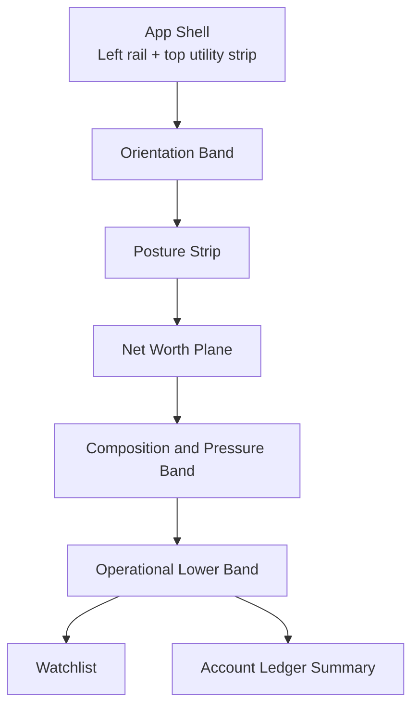

# Privestio Dashboard Concept Spec

## Purpose

Define the first high-fidelity screen concept for the Privestio rewrite: the authenticated dashboard.

This document turns the dashboard direction from:

- [UI-VISUAL-THESIS.md](./UI-VISUAL-THESIS.md)
- [UI-CONTENT-PLAN.md](./UI-CONTENT-PLAN.md)
- [UI-INTERACTION-THESIS.md](./UI-INTERACTION-THESIS.md)
- [UI-REWRITE-CHECKLIST.md](./UI-REWRITE-CHECKLIST.md)

into a concrete screen specification that can be implemented in Blazor without inventing layout, copy, or interaction rules ad hoc.

## Concept Statement

The dashboard should feel like opening a household finance ledger already in progress: one wide net-worth plane anchors the screen, the surrounding evidence explains the posture, and the exceptions zone tells the user where intervention is required now.

## Screen Job

The dashboard must answer four things within one glance:

1. where the household stands now
2. how that position has been moving
3. what structural forces explain it
4. what needs attention next

## First-View Takeaway

"This is where I stand, how I got here, and what needs attention now."

## Layout Doctrine

- The dashboard is not a hero page.
- The chart is the primary plane, not a widget inside a card.
- Summary values support the chart; they do not compete with it.
- Exceptions should read like an operations list, not a feed of notifications.
- The shell must remain visible and stable while the dashboard content settles into place.

## Spatial Composition

### Desktop Structure

### Region Intent

- Orientation band: frame the time context and expose the two or three highest-value actions.
- Posture strip: provide the quickest financial read without turning the screen into KPI tiles.
- Net worth plane: own the page with a calm, authoritative trajectory view.
- Composition and pressure band: explain what the household is made of and where structural exposure sits.
- Lower operational band: show intervention and drill-in paths.

## Desktop Layout Spec

### 1. Orientation Band

Position:
Full width beneath the persistent app chrome.

Contents:

- Page title: `Dashboard`
- Description: `Current financial position, recent movement, and active issues.`
- Left-side context control: date range selector
- Right-side actions: `Add transaction`, `Sync prices`, `Alerts`

Rules:

- Keep the description to one sentence.
- Do not place stat tiles here.
- Do not use promotional or aspirational copy.
- The range selector must sit inside the band, not float above the chart.

### 2. Posture Strip

Position:
Immediately below the orientation band as one horizontal band.

Metrics:

- Net worth
- Assets
- Liabilities
- Last refresh
- Unresolved alerts

Visual treatment:

- Near-flat band with thin dividers between metric groups
- No independent card containers
- Newsreader reserved for the net worth figure only
- Smaller operational labels in Familjen Grotesk

Behavior:

- Values crossfade or count lightly on refresh
- Alert count changes tone immediately when new urgent items appear

### 3. Net Worth Plane

Position:
Dominant full-width surface directly under the posture strip.

Primary content:

- Net worth trajectory line
- Optional overlays for assets and liabilities
- X-axis tied to selected date range
- Y-axis scaled for legibility, not dramatization

Secondary content inside the same plane:

- Range selector confirmation
- Compact legend for overlays
- Hover value rail showing date, net worth, assets, liabilities

Visual treatment:

- Darker graphite chart surface within the lighter page field
- Thin frame lines and restrained axis treatment
- One verdigris primary line for net worth
- Assets and liabilities in muted graphite-derived tones, not competing accent colors
- No chart card chrome, no ornamental gradient fills, no donut inserts

Behavior:

- On initial load, frame first, line second, labels last
- On range change, line morphs from current geometry when possible
- Tooltip uses a thin rule and compact value panel rather than a large floating bubble
- Empty state sits inside the chart frame and explains what missing data would produce a usable history

### 4. Composition And Pressure Band

Position:
Directly below the net worth plane in two unequal columns.

Left column:

- Section heading: `Composition`
- Primary view: asset allocation by major class
- Secondary summaries: debt share, cash concentration, registered vs non-registered exposure

Right column:

- Section heading: `Pressure`
- Compact structural indicators for debt load, cash thinness, and near-term funding stress

Rules:

- Avoid playful chart types or saturated palette spreads.
- Prefer bars, stacked rails, or narrow composition slices over decorative pies.
- This band explains totals; it should not duplicate the watchlist.

### 5. Operational Lower Band

Position:
Bottom section of the dashboard in a 5:7 split.

Left column: Watchlist

- Section heading: `Watchlist`
- Description: `Items that need review before they distort balances, budgets, or forecast confidence.`
- Row types:
- stale prices
- missing balances
- overspent categories
- failed imports
- upcoming cash pressure

Right column: Accounts

- Section heading: `Accounts`
- Description: `Largest balances and recent movement across active accounts.`
- Dense table or ledger list showing:
- account name
- type
- institution
- current balance
- recent movement
- status

Rules:

- Watchlist rows should feel like operational issues, not toast messages.
- Accounts list should support direct drill-in to the full accounts workspace.
- Neither column should become a card stack.

## Mobile And Tablet Adaptation

### Tablet

- Keep the orientation band intact.
- Keep the posture strip as a wrapping band rather than collapsing to separate cards.
- Keep the net worth plane full width.
- Stack composition above watchlist above accounts.
- Preserve section order from highest decision value to lowest.

### Mobile

- Keep the left rail accessible as a drawer, but keep the page chrome stable.
- Orientation band becomes a vertically stacked intro with inline range selector and actions.
- Posture strip becomes a two-column wrapped ledger band, not swipeable KPI tiles.
- Net worth plane stays immediately visible after the posture strip.
- Composition, watchlist, and accounts stack vertically.
- Alert and sync actions remain accessible without requiring horizontal overflow.

## Exact Copy Spec

### Page Copy

- Title: `Dashboard`
- Description: `Current financial position, recent movement, and active issues.`

### Action Labels

- `Add transaction`
- `Sync prices`
- `Alerts`

### Section Headings

- `Net worth`
- `Composition`
- `Pressure`
- `Watchlist`
- `Accounts`

### Avoid These Alternatives

- `Wealth snapshot`
- `Smart insights`
- `Your financial future`
- `Money at a glance`
- `Recommended actions`

## Visual Spec

### Color Application

- Page field: Bone or oat base
- Shell framing: Graphite and coal
- Primary accent: Verdigris only
- Gain values: use gain green as a data signal only
- Risk values: use risk red only where a threshold or issue exists
- Forecast-linked pressure references: use forecast gold only when future exposure is being signaled

### Typography Application

- Familjen Grotesk: navigation, labels, filters, table headers, body copy, metadata
- Newsreader: page title if needed, net worth value, occasional section-emphasis numbers

Rules:

- Only one or two serif emphasis moments on the dashboard
- Do not set routine labels or dense tables in serif

### Surface Application

- Routine dashboard regions should be mostly flat
- The chart plane may use a darker inset surface
- Inspector, alert drawer, or layered overlays may use smoked-glass treatment
- Corners should be sharp or near-square

## Interaction Spec

### Entrance Sequence

Timing:
220 to 360 ms total perceived entrance.

Order:

1. orientation band settles in
2. posture strip appears
3. net worth plane settles with strongest emphasis
4. lower evidence bands fade in last

Rules:

- No bounce
- No staggered card cascade
- No oversized blur or theatrical reveal

### Range Change Behavior

- Range selector updates the chart in place
- Net worth, assets, and liabilities values crossfade quickly
- Composition and watchlist only refresh if their data actually changes
- The page frame and scroll position remain stable

### Hover And Focus Behavior

- Chart hover uses a thin rule and dot with compact values
- Watchlist hover slightly raises contrast but does not glow
- Account row hover is structural and calm
- Keyboard focus must be visible without neon accent flooding

### Alerts Interaction

- `Alerts` opens a right-side sheet, not a full page replacement
- The base dashboard remains visible behind the sheet
- Closing the sheet returns focus to the invoking control

## State Design

### Loading

- Keep the shell and page headings visible
- Use localized skeletons for posture values, chart frame, watchlist rows, and account rows
- Do not replace the whole page with a centered spinner

### Empty

Dashboard with no usable data should still render the full structure.

Recommended empty-state approach:

- Posture strip shows placeholder values with clear zero or unavailable states
- Chart frame remains visible with message: `No net worth history yet.`
- Supporting note: `Add accounts and sync balances or prices to build a trend.`
- Watchlist explains there are no active issues only when the system is actually healthy, not merely empty

### Error

- If only the chart fails, error stays inside the chart frame
- If watchlist fails, error stays in the watchlist region
- Page-level bars are reserved for blocked dashboard loads only

## Data Contract Expectations

The screen concept assumes the dashboard can draw from or derive:

- current net worth
- current assets and liabilities
- net worth history by date range
- last successful refresh timestamp
- unresolved alert count and alert summaries
- allocation or composition breakdowns
- top accounts with current balances and recent movement

If some data is unavailable at first implementation, preserve the region and use explicit placeholder states instead of collapsing the layout.

## Component Inventory

The dashboard should be implementable from a small shared set of primitives:

- app shell with left rail and top utility strip
- orientation band component
- posture strip component
- chart plane component
- composition band component
- watchlist table or list component
- compact accounts ledger component
- right-side alert sheet
- skeleton and localized error primitives

## Build Notes For Blazor

- Prefer layout sections and dividers over nested `FluentCard` stacks.
- Use Fluent components where they help with accessibility and interaction, but constrain them to the new visual system rather than inheriting default SaaS styling.
- The chart region should be treated as a first-class component with its own loading, empty, and error states.
- The dashboard route should be a destination page, not a marketing composition reused from `/`.
- Structure the page so the shell and orientation band remain renderable even when downstream data calls fail.

## Acceptance Criteria

- A user can identify net worth, assets, liabilities, freshness, and unresolved issues without scrolling.
- The net worth chart is the unmistakable focal point of the screen.
- The screen feels calm and exact rather than promotional or gamified.
- The dashboard uses bands, lists, and tables rather than a field of cards.
- The dashboard remains legible and useful in loading, empty, and partial-failure states.
- The dashboard preserves orientation when changing time range or opening alerts.

## Litmus Test

If this concept is implemented correctly, the user should open the dashboard and immediately feel:

1. this is private financial infrastructure
2. the important number is grounded in evidence
3. the system knows what needs attention next

## Next Implementation Step

Use this document to create:

1. the dashboard shell and region scaffolding
2. the dashboard-specific data contract and placeholder states
3. the first visual pass of the net worth plane and watchlist
